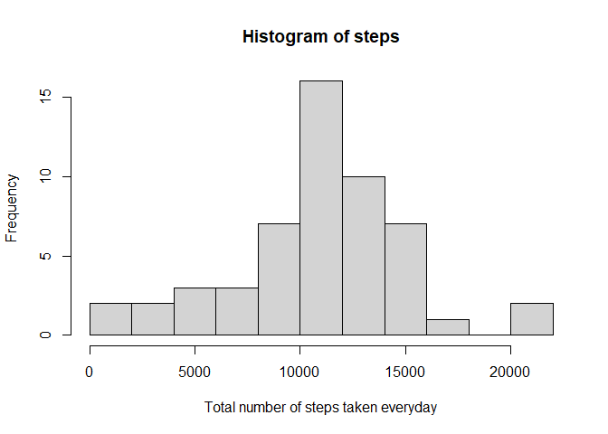
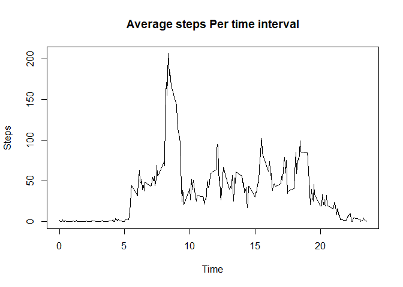
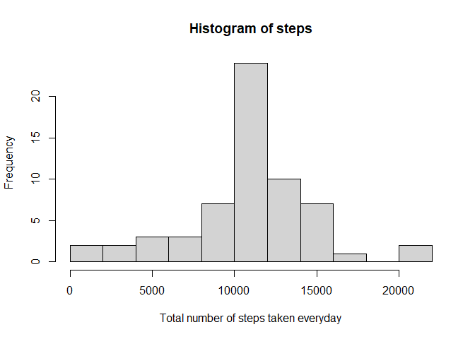
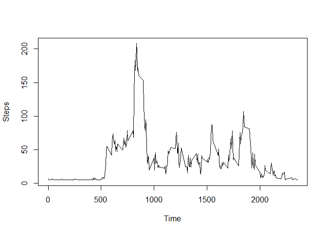
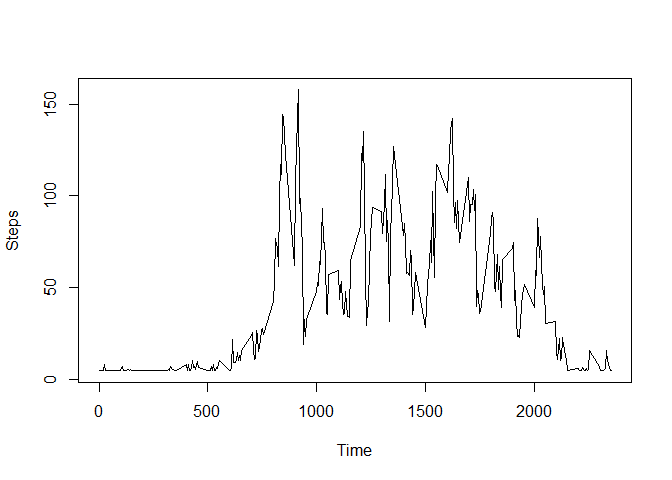

Frist loading the data and completing the case impling removing NAs also
I download the data on my computer and extracted it and then read it here
Also changing the data of character to date format.


```r
g<-read.csv("F:\\repdata_data_activity\\activity.csv")
cc<-complete.cases(g)
cd<-g[cc,]
cd$date<-as.Date(cd$date,format = "%Y-%m-%d")
head(cd)
```

```
##     steps       date interval
## 289     0 2012-10-02        0
## 290     0 2012-10-02        5
## 291     0 2012-10-02       10
## 292     0 2012-10-02       15
## 293     0 2012-10-02       20
## 294     0 2012-10-02       25
```

Loading the Dplyr library just in case it is needed
second I calculated steps for each date
and then plotted the histogram


```r
library(dplyr)
```

```
## 
## Attaching package: 'dplyr'
```

```
## The following objects are masked from 'package:stats':
## 
##     filter, lag
```

```
## The following objects are masked from 'package:base':
## 
##     intersect, setdiff, setequal, union
```

```r
spd <- aggregate(cd$steps, list(cd$date), FUN=sum)
hist(spd$x,breaks=10,xlab = "Total number of steps taken everyday",main = "Histogram of steps")
```

<!-- -->


Now finding the mean and median


```r
mean(spd$x)
```

```
## [1] 10766.19
```

```r
median(spd$x)
```

```
## [1] 10765
```

Making a time series plot of the 5-minute interval
For that I aggregated steps with interval from the data also remember the data is 
complete here


```r
spt<-aggregate(cd$steps~cd$interval,data=cd,FUN=mean)
spt$`cd$interval`<-spt$`cd$interval`/100
plot(spt$`cd$interval`,spt$`cd$steps`,type = "l",main = "Average steps Per time interval",xlab = "Time", ylab = "Steps")
```

<!-- -->

On average across all the days in the dataset, finding time the maximum number of steps


```r
ms <- tbl_df(spt)
```

```
## Warning: `tbl_df()` is deprecated as of dplyr 1.0.0.
## Please use `tibble::as_tibble()` instead.
## This warning is displayed once every 8 hours.
## Call `lifecycle::last_warnings()` to see where this warning was generated.
```

```r
ms %>% select(`cd$steps`,`cd$interval`) %>% filter(`cd$steps` == max(ms$`cd$steps`))
```

```
## # A tibble: 1 x 2
##   `cd$steps` `cd$interval`
##        <dbl>         <dbl>
## 1       206.          8.35
```

Now finding all the missing values in the dataset by taking the complete case 
value and summing it 


```r
mv<-sum(!cc)
print(mv)
```

```
## [1] 2304
```

First changing the data from character to date in original data that I loaded in
g variable I took the mean and replaced the NAs from it as shown in code
and then I made a new dataframe from the newly generated data then I plotted 
the histogram via the same aggregate function as shown
 

```r
g$date<-as.Date(g$date,format = "%Y-%m-%d")
as<-round(mean(spt$`cd$steps`),0) 
g$ns<- ifelse(is.na(g$steps), as , g$steps)
ndf<-data.frame(steps = g$ns,date = g$date, interval = g$interval)
nspd<- aggregate(ndf$steps, list(ndf$date), FUN=sum)
hist(nspd$x,breaks=10,xlab = "Total number of steps taken everyday",main = "Histogram of steps")
```

<!-- -->

Now finding mean and median with new data


```r
nme<-mean(nspd$x)
nmed<-median(nspd$x)
```

Now forming new column weekday and daytype
daytype can be weekend or weekday


```r
ndf$weekday<-weekdays(ndf$date)
ndf$daytype<-ifelse(ndf$weekday=='Saturday' | ndf$weekday=='Sunday', 'weekend','weekday')
head(ndf)
```

```
##   steps       date interval weekday daytype
## 1    37 2012-10-01        0  Monday weekday
## 2    37 2012-10-01        5  Monday weekday
## 3    37 2012-10-01       10  Monday weekday
## 4    37 2012-10-01       15  Monday weekday
## 5    37 2012-10-01       20  Monday weekday
## 6    37 2012-10-01       25  Monday weekday
```

now aggregated the new data via daytype and plotting the data
two sets of data is made here


```r
nspt<-aggregate(steps~interval+daytype,data=ndf,FUN = mean)
weekd<-filter(nspt,daytype == "weekday")
weeke<-filter(nspt,daytype == "weekend")
```

The first plot is weekday


```r
plot(weekd$interval,weekd$steps,type="l",xlab = "Time", ylab = "Steps")
```

<!-- -->

The second plot is weekend


```r
plot(weeke$interval,weeke$steps,type="l",xlab = "Time", ylab = "Steps")
```

<!-- -->
